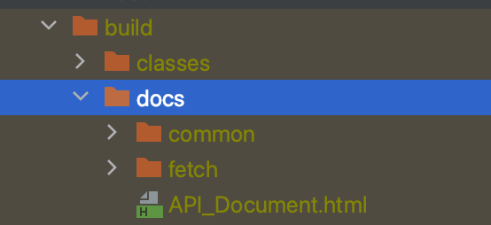
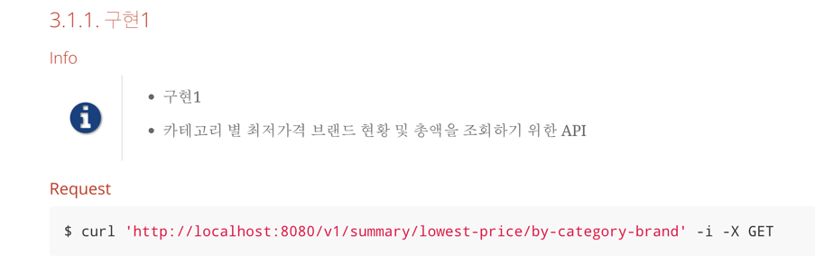

##목차
- 구현범위
- 개발환경
- 실행 및 환경
- 테스트 방법
- API 관련 참고사항
- 테이블설계

### 구현범위
- 구현1~4 : 구현완료
- unit test, integration test : 구현완료
- api 문서 restdoc : 구현완료

### 개발환경
- Java21
- Spring Boot 3.3.10
- h2 db (메모리 기반에서 동작하도록 함)
- gradle-8.13

### 실행 및 환경
~~~
실행방법 : ./gradlew clean build 실행 후 
java -jar ./build/libs/ohj-0.0.1-SNAPSHOT.jar를 실행하면 됩니다
~~~
~~~
spring.threads.virtual.enabled=true 가상스레드로 실행
개발 진행시 아래옵션 추가 후 실행 (코드 혹은 내부 라이브러리 synchronized 코드 확인용) - 이상없음
-Djdk.tracePinnedThreads=full
(참고 - 해당 옵션 설정 후 아래와 같은 로그가 발생한다면 확인해봐야함
Thread[#56,ForkJoinPool-1-worker-1,5,CarrierThreads]
    java.base/java.lang.VirtualThread$VThreadContinuation.onPinned(VirtualThread.java:183)) 
~~~
~~~
QueryDSL SrpingBoot 3.x 버전부터는 QueryDSL 플러그인이 필요없음
clean후 complieJava 또는 complieTestJava로 진행하시면됩니다 (아래이미지 참고)
~~~

~~~
restdoc 적용
./gradlew clean build 실행 후 아래 이미지 경로 참고 (API_Document.html 파일 실행)
~~~

### 테스트 방법
~~~
위 restdoc 파일을 열어보면 curl을 확인 할 수 있음
애플리케이션 실행 후 curl로 api를 테스트해 볼 수 있습니다
~~~

### API 관련 참고사항
~~~
구현1 : 
 응답 예시엔 카테고리별 최저가를 가진 브랜드가 하나만 존재하는걸로 보이지만 다수도 존재 할 수 있다고 판단하여 다수도 리턴할 수 있도록 개발함
구현 2 :
 응답 예시엔 단일 브랜드내 모든 카테고리에 등록된 상품 합계가 최저인 브랜드가 한곳만 존재하는걸로 보이지만 다수도 존재 할 수 있다고 판단하여 다수도 리턴할 수 있도록 개발함
~~~

### 테이블 설계
~~~
카테고리 테이블 - 카테고리 정보가 저장되는 테이블
브랜드 테이블 - 브랜드 정보가 저장되는 테이블                      
상품 테이블 - 상품 정보가 저장되는 테이블 (카테고리 및 브랜드 정보가 존재해야한다)

약어 참고
seq - sequence
nm - name
dt - datetime
~~~
- category - 카테고리 테이블

| Column | Data Type | Constraints | Not Null | Comment |
|:------:|:------:|:-------:|:----:|:---------:|
| category_seq | BIGINT | PK | Y | category_seq 시퀀스 |
| category_nm | VARCHAR | | Y | 카테고리명 |
| create_dt | DATETIME | | Y | 등록일 |
| create_id | VARCHAR | | Y | 등록ID |
| update_dt | DATETIME | | | 수정일 |
| update_id | VARCHAR | | | 수정ID |

- brand - 브랜드 테이블

| Column | Data Type | Constraints | Not Null | Comment |
|:------:|:------:|:-------:|:----:|:---------:|
| brand_seq | BIGINT | PK | Y | brand_seq 시퀀스 |
| brand_nm | VARCHAR | | Y | 브랜드명 |
| create_dt | DATETIME | | Y | 등록일 |
| create_id | VARCHAR | | Y | 등록ID |
| update_dt | DATETIME | | | 수정일 |
| update_id | VARCHAR | | | 수정ID |

- product - 상품 테이블

| Column | Data Type | Constraints | Not Null | Comment |
|:------:|:------:|:-------:|:----:|:---------:|
| product_seq | BIGINT | PK | Y | product_seq 시퀀스 |
| brand_seq | BIGINT | | Y | brand.brand_seq |
| category_seq | BIGINT | | Y | category.category_seq |
| product_nm | VARCHAR | | Y | 상품명 |
| product_price | BIGINT | | Y | 상품가격 |
| create_dt | DATETIME | | Y | 등록일 |
| create_id | VARCHAR | | Y | 등록ID |
| update_dt | DATETIME | | | 수정일 |
| update_id | VARCHAR | | | 수정ID |

